

    

# Takumi (匠) — Architecture Diagrams

> All diagrams use Mermaid syntax. Render with any Mermaid-compatible viewer
> (GitHub, VS Code Mermaid extension, mermaid.live, etc.)

---

## 1. System Architecture — High Level

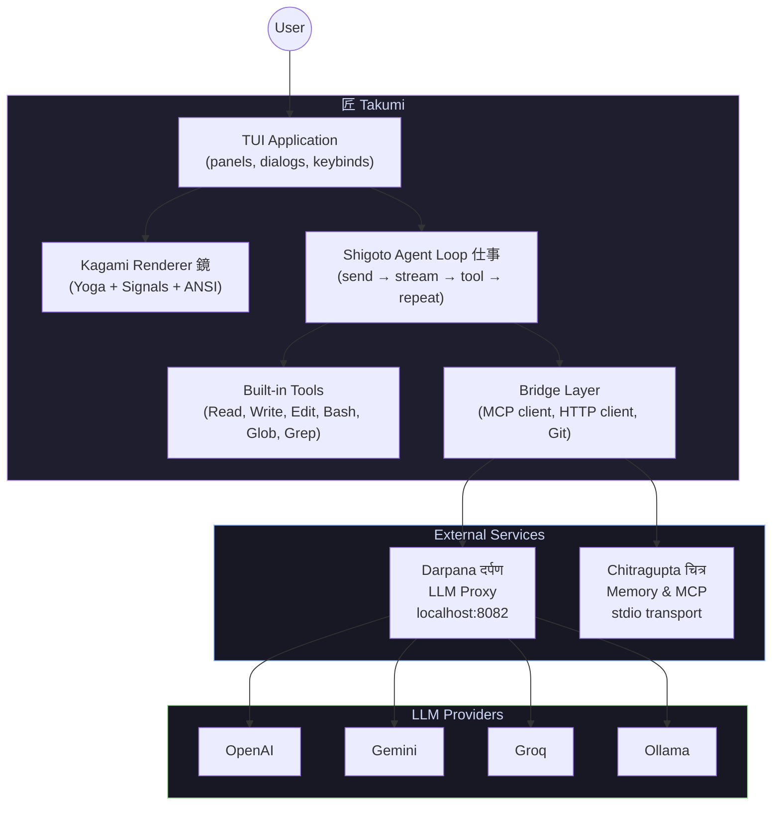

---

## 2. Application State Machine

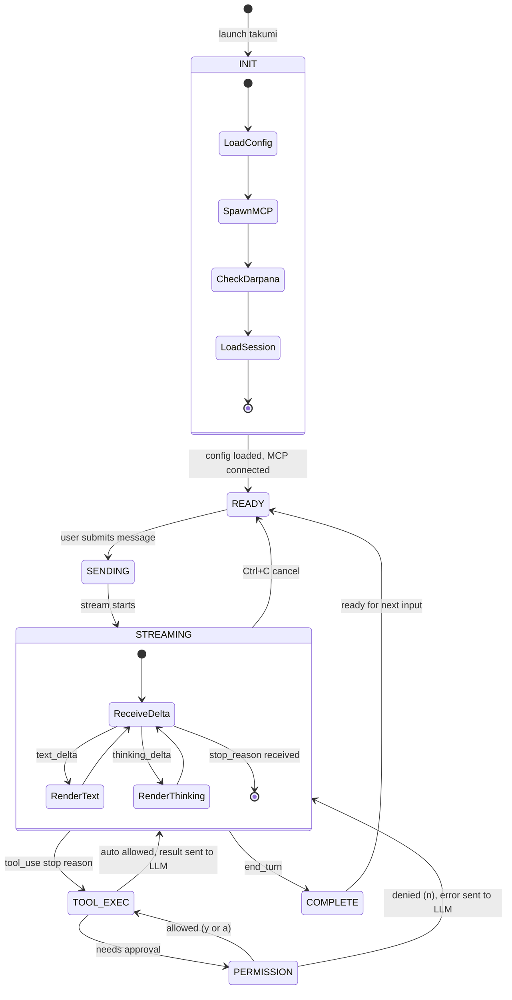

---

## 3. Renderer Pipeline State Machine

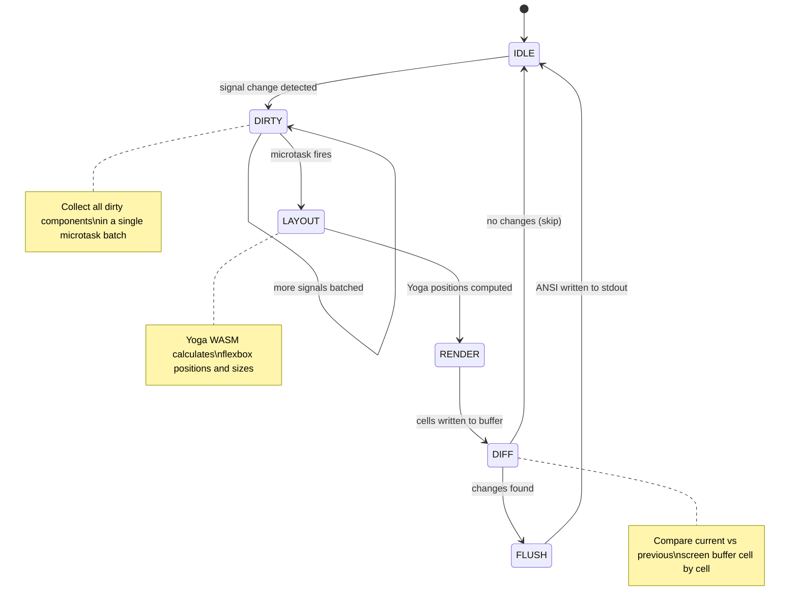

---

## 4. Agent Loop Sequence Diagram

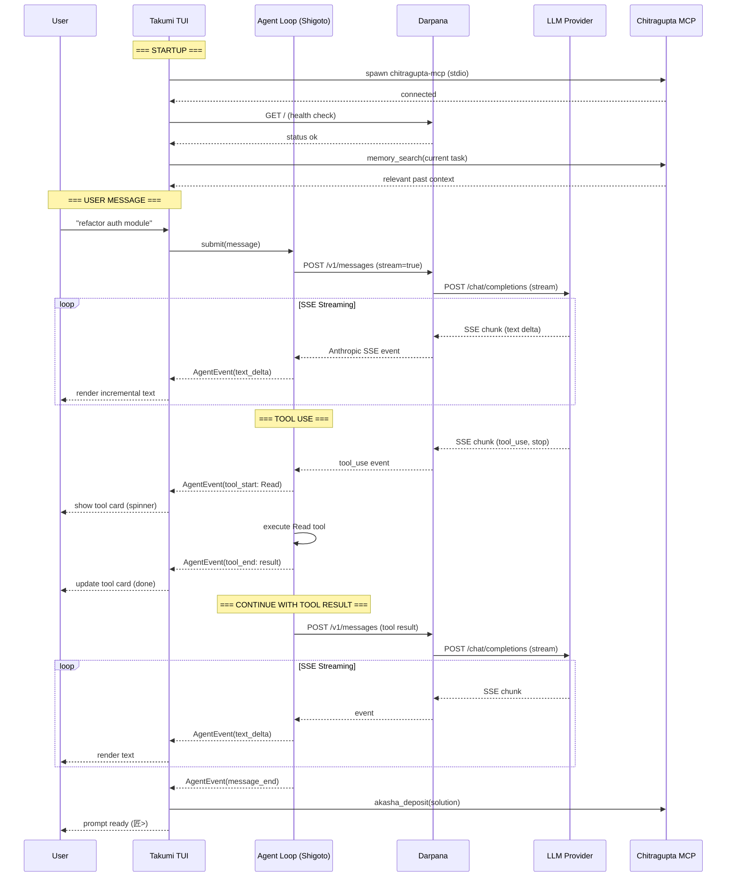

---

## 5. Input Mode State Machine

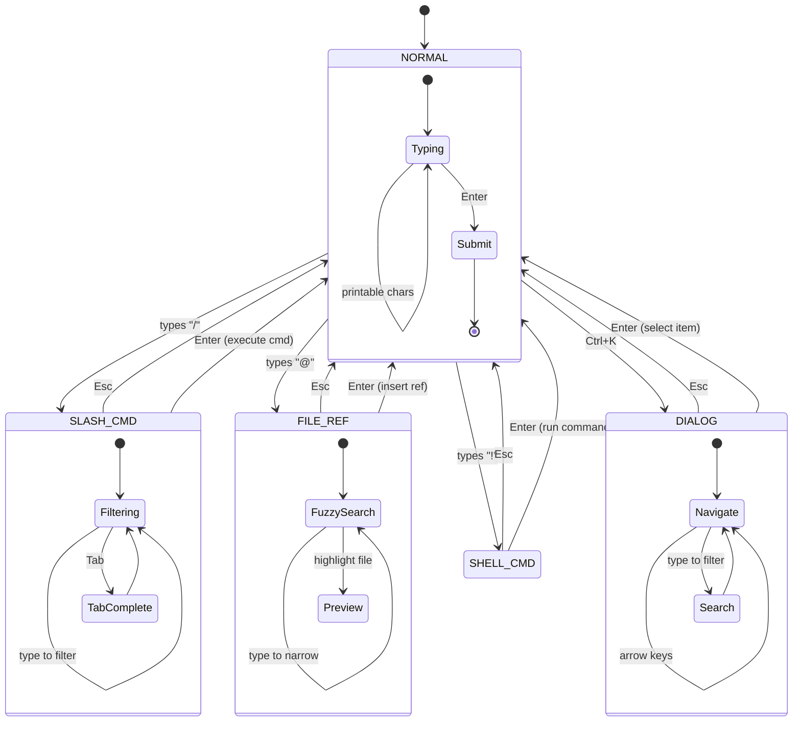

---

## 6. TUI Layout Structure

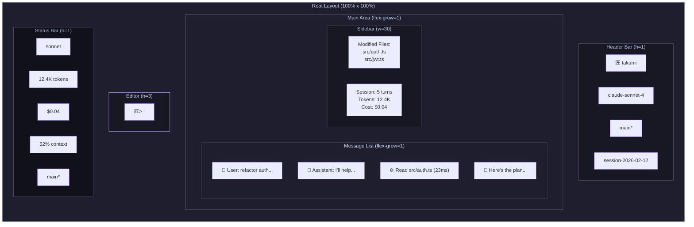

---

## 7. Permission Flow

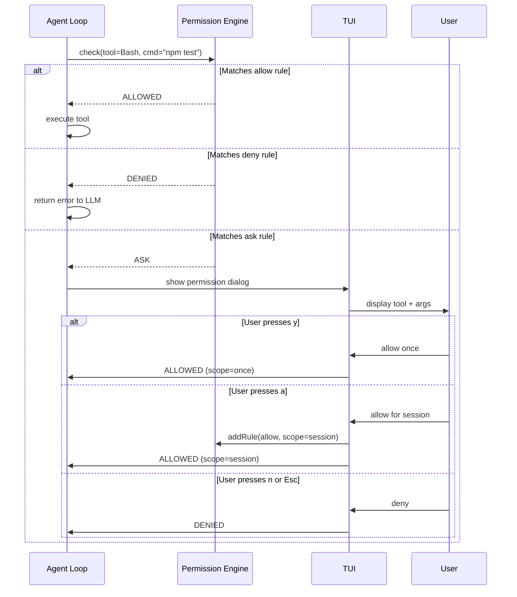

---

## 8. Context Compaction Flow

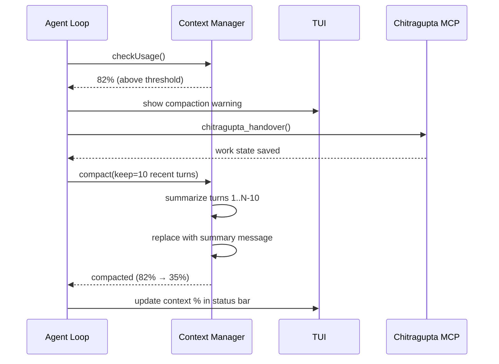

---

## 9. Package Dependency Graph

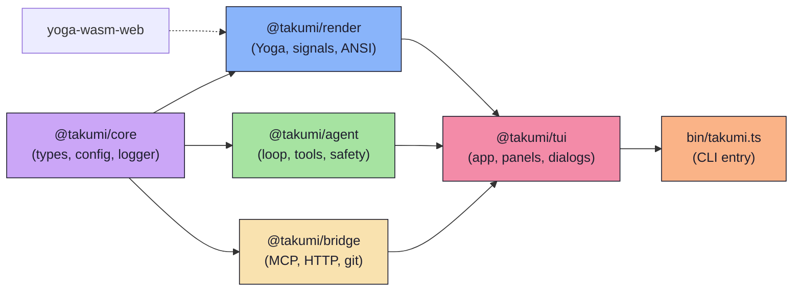

---

## 10. Startup Sequence

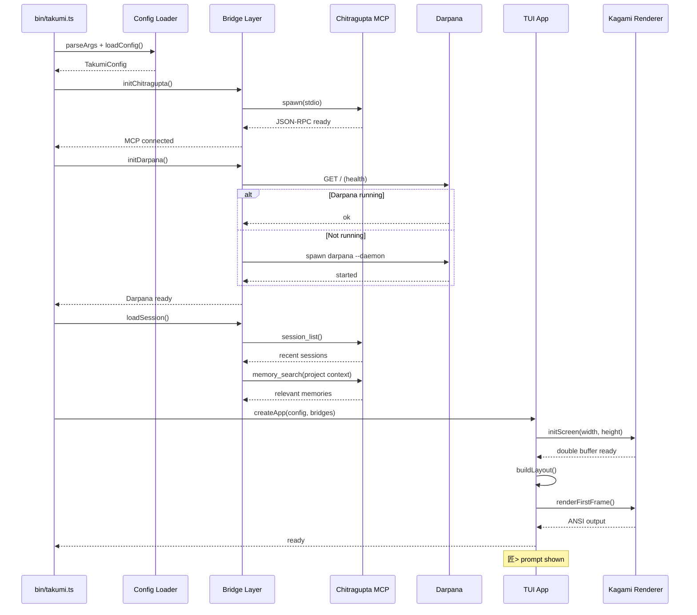

---

## 11. Signal Reactivity Data Flow

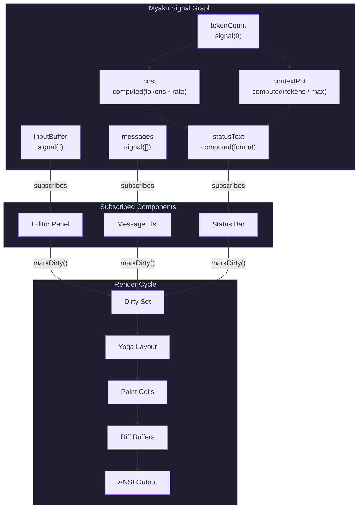

---

## 12. Tool Execution Pipeline

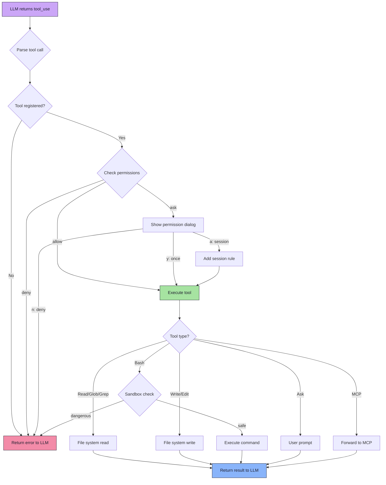
