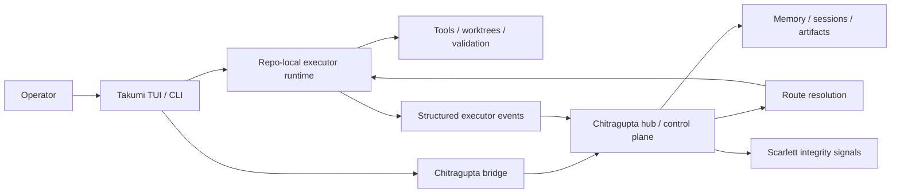
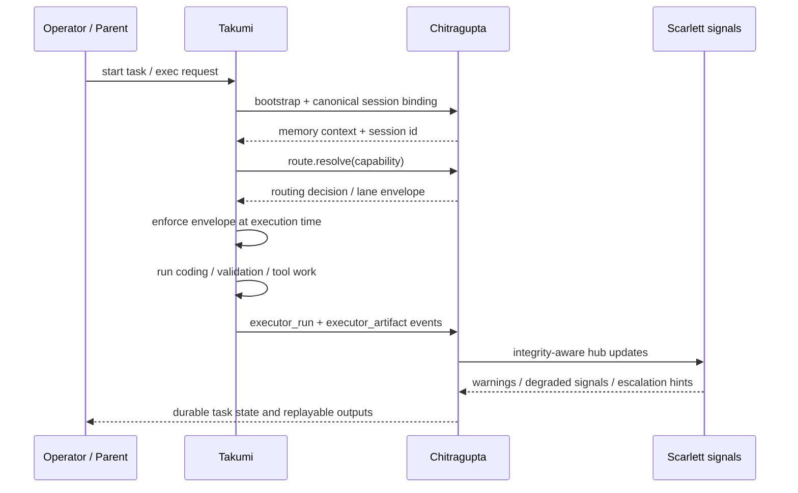

# Takumi Review Packet

> Executive architecture packet for serious technical review.
>
> This document is intentionally shorter and more decision-oriented than the
> deeper implementation notes. It is meant for design review, partner handoff,
> and “tell me what is real vs directional” conversations.

## One-page summary

Takumi is a terminal-native coding executor with a custom renderer, a typed
tool/runtime layer, multi-agent orchestration, and growing control-plane
integration with Chitragupta.

The current strategic split is:

- **Chitragupta** owns the emerging hub/control-plane role
- **Takumi** owns privileged repo-local execution and operator UX
- **Scarlett** owns integrity and supervision signals

This split exists to avoid two failure modes:

1. Takumi becoming a sovereign mini-platform with duplicate routing and memory
2. Chitragupta becoming a repo-local god-object that absorbs runtime concerns

The right boundary is:

- Chitragupta decides **what lane should run, with what authority, under what policy**
- Takumi decides **how to perform the work safely inside the repo**
- Scarlett decides **whether the system is still trustworthy while this happens**

## What is live vs directional

| Area | Live on `main` | Directional / still maturing |
|---|---|---|
| Terminal UI | custom renderer-backed TUI | richer desktop / visual shell |
| Provider execution | direct providers, optional proxying | further inversion of provider authority toward Chitragupta |
| Chitragupta bridge | daemon-first bootstrap, session/memory/control-plane hooks | stronger hub ownership of routing, packing, and promotion policy |
| Executor contract | `takumi exec --headless --stream=ndjson` with `takumi.exec.v1` | broader parent/orchestrator adoption |
| Routing | engine-resolved lanes preserved as executor envelopes | more complete engine ownership of all route authority |
| Sabha | tracked state, default council, executor outcome recording | richer executor-specific deliberation payloads |
| UI/UX | strong terminal operator UX | non-terminal UX for broader operator audiences |

## Current architecture, in one picture

## Critical runtime sequence

The core executor-control-plane loop now looks like this:

## Why the current split is correct

### Decision 1: the hub belongs to Chitragupta

**Why:** route selection, memory attachment, task durability, and artifact
promotion are cross-run concerns. They should not live only inside a terminal
session process.

**Consequence:** Takumi can still be highly capable without becoming the source
of durable truth.

### Decision 2: Takumi remains the privileged executor

**Why:** repo-local editing, testing, worktree operations, permission-gated tool
execution, and terminal-native workflows are runtime concerns with tight local
feedback loops.

**Consequence:** Chitragupta should orchestrate Takumi, not reimplement Takumi.

### Decision 3: integrity is its own concern

**Why:** once routing, delegation, councils, and multi-lane work exist, trust
must be modeled explicitly. Scarlett is the layer that can say “slow down”,
“quarantine this lane”, or “raise validation strength.”

**Consequence:** capability growth is less likely to quietly rot correctness.

## What changed recently

The recent executor retrofit materially improved the boundary quality.

### Delivered

- engine-owned routing is preserved as executor-side lane envelopes
- execution-time enforcement records when Takumi had to fall back locally
- TUI and headless runs can bind to canonical Chitragupta sessions
- executor outcomes and artifacts are reported in structured form
- slash commands are more hub-aware
- `takumi.exec.v1` provides a stable headless process contract
- `/sabha` exposes tracked deliberation state, working agents, available lanes,
  and the default council shape

### Still intentionally partial

- packing/compression policy is not yet fully hub-centralized
- Sabha participation is real but still lightweight from the executor side
- UI/UX is still optimized for terminal-native operators more than broader
  visual workflows

## Status table

| Topic | Status | Evidence |
|---|---|---|
| Canonical hub boundary | done | `docs/agent-hub-boundary.md` |
| Backlog-to-code traceability | done | `docs/takumi-executor-backlog-implementation-note.md` |
| Stable headless execution contract | done | `packages/core/src/exec-protocol.ts`, `bin/cli/one-shot.ts` |
| Parent-side spawn contract | done | `packages/bridge/src/takumi-exec-contract.ts`, `packages/bridge/src/takumi-exec-runner.ts` |
| Route envelope preservation | done | `packages/agent/src/task-routing.ts`, `packages/bridge/src/control-plane.ts` |
| Structured executor reporting | done | `packages/bridge/src/observation-types.ts`, `packages/tui/src/coding-agent.ts` |
| Hub-aware slash commands | done | `packages/tui/src/app-command-macros.ts`, `packages/tui/src/app-commands-chitragupta.ts` |
| Default Sabha visibility | done | `packages/tui/src/sabha-defaults.ts`, `/sabha` command |
| Hub-owned packing/compression | partial | local refresh exists, policy centralization still pending |
| Rich executor Sabha payloads | partial | lightweight recording exists; richer protocol pending |
| UI/UX beyond terminal-native flow | partial | roadmap exists, current product remains TUI-first |

## Validation snapshot

Recent focused validation for the executor + Sabha work included:

- `pnpm build`
- targeted Vitest slices for routing, exec protocol, bridge runner behavior,
  Chitragupta integration, coding-agent behavior, and `/sabha`

Most recent focused run in this session:

- `pnpm build && pnpm exec vitest run packages/tui/test/chitragupta-sabha-command.test.ts packages/tui/test/chitragupta-integration.test.ts`
- result: passed

## UI/UX reality check

Takumi already has a real UI, but it is a **terminal UI**, not yet a broad
desktop-grade visual product.

Current reality:

- the operator experience is TUI-first
- multi-lane/side-agent workflows still lean on tmux/worktrees in practice
- there is repo evidence of a desktop shell direction, but not a mature shipped
  non-terminal product surface yet

That is not a flaw to hide; it is a scope truth to manage. The terminal UX is a
strength for power users, but broader adoption will require a clearer visual UX
layer. See `docs/ui-ux-roadmap.md`.

## Reading order for reviewers

If you only have 15 minutes:

1. `README.md`
2. `docs/review-packet.md`
3. `docs/agent-hub-boundary.md`
4. `docs/takumi-executor-backlog-implementation-note.md`

If you want the implementation handoff path:

1. `docs/agent-hub-boundary.md`
2. `docs/chitragupta-takumi-exec-handoff.md`
3. `docs/cli-adapter-contract.md`
4. `docs/control-plane-spec.md`

## Glossary

| Term | Meaning |
|---|---|
| hub | Chitragupta’s control-plane role for routing, memory attachment, task/artifact durability, and escalation policy |
| lane | a concrete execution path or capability path chosen for a task or role |
| route envelope | durable executor-side record of engine-selected routing authority, enforcement mode, selected lane, and fallback state |
| canonical session | the Chitragupta-bound session id used as durable cross-run truth |
| Sabha | deliberation/council mechanism for contested, escalated, or higher-stakes decisions |
| fallback authority | explicit record that Takumi applied a safe local fallback instead of silently pretending engine routing was used |

## Bottom line

Takumi is now in a credible reviewable state for architecture and implementation
handoff:

- the control-plane boundary is explicit
- the executor contract is real and typed
- the backlog work is traceable to code
- the remaining gaps are named rather than hidden

That makes the project much more legible to serious reviewers — including the
kind who get suspicious the moment a system says “trust me, it’s all wired” with
no receipts.